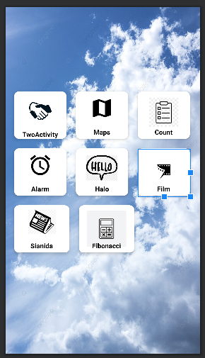
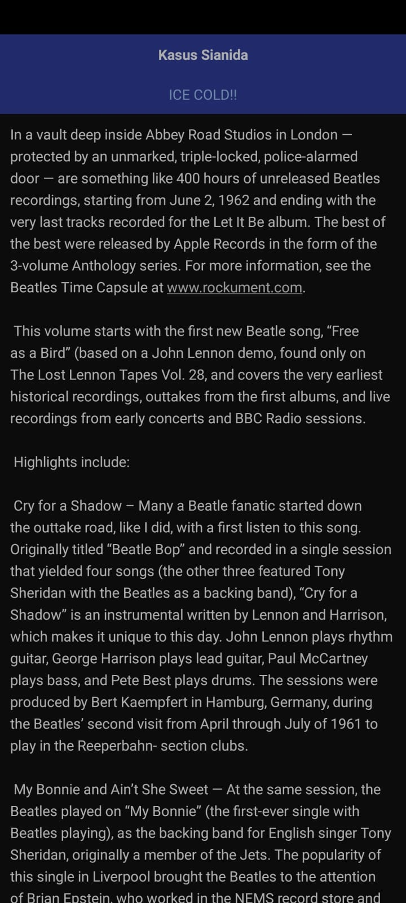
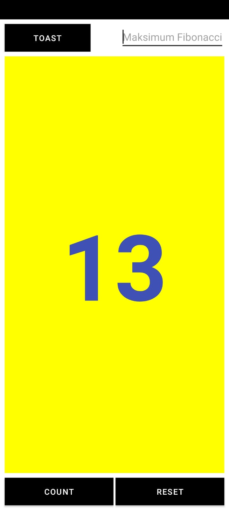
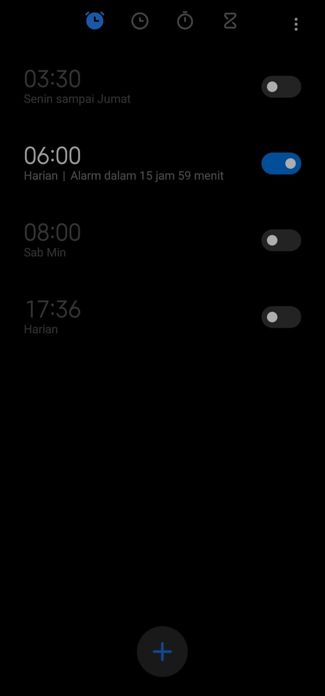
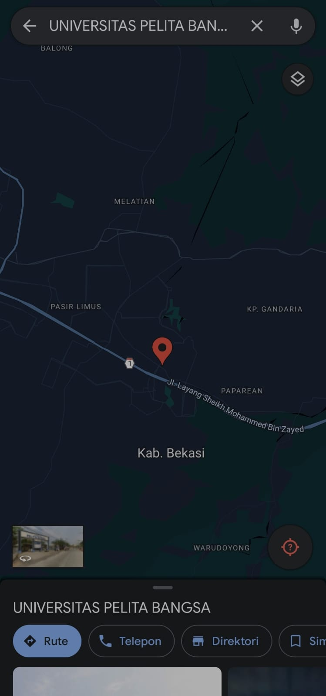

# uas-mobile

```
Nama  : Mohammad Hapiyansyah
NIM   : 312210243
Kelas : TI.22.A2
```

#  Logo


#  Menu utama



## 1. Halo activity


## 2. Two Activity


## 3. Kasus Sianida



## 4. Fibonacci / Count



## 5. Alarm



## 6. Google maps


 
## 7. Movie


# Laporan UAS (PDF)

laporan nya ada di atas pak...
